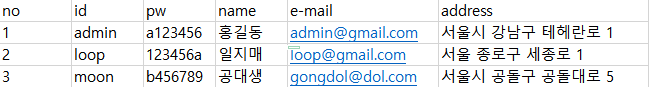
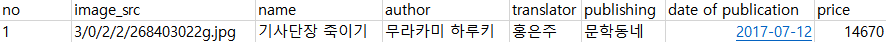
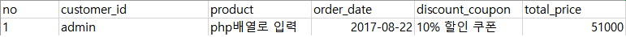

쇼핑몰 만들기
===
쇼핑몰
====
개발이유
---
학교에서 따로 공부하는 php로 쇼핑몰을 만드려고 한다.

필요한 기능
---------
1. 도서 추천 페이지
2. 도서 목록
3. 장바구니
4. 결제 페이지
5. 회원 정보 수정
6. 주문 정보 조회
7. 로그인 페이지
8. 도서 검색
9. 쿠폰 페이지
10. 관리자 페이지

기술
=====
사용 기술
----
1. html
2. CSS
3. JavaScript
4. PHP
5. mysql

회원정보 데이터 베이스 예시
----

  
책 정보 데이터 베이스 예시
---

  
주문기록 데이터 베이스 예시
---

